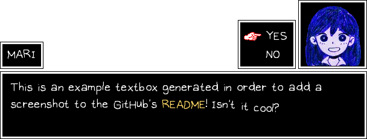

# Omoribot 3

A discord bot for creating OMORI-styled text boxes.

### How do run?

First, install Poetry by [following the instructions in the official documentation](https://python-poetry.org/docs/#installing-with-the-official-installer).

Second, make sure `ffmpeg` is installed. If you're on Linux, it should just be a matter of `apt install ffmpeg` or `dnf install ffmpeg` or similar.

1. Place bot token into `token` next to `main.py` (Message content intent required)
2. Place dialogue portraits into `portraits/`
3. `poetry install`
4. `poetry run omoribot` (pass in `local` to use `!` as the prefix, meant for debugging)

### How do use?

Read the [Usage guide](USAGE.md) to learn how to use OMORIBOT.

### Why is it #3?

omoribot 1 is the original version of omoribot,
written with very shoddy platform-specific Python code.

omoribot 2 was a failed attempt to rewrite omoribot with C#, abandoned
after discovering the lack of functioning cross-platform drawing libraries
for C#.

omoribot 3 is also written in Python, though this version has a very flexible design and should in theory be cross-platform.
