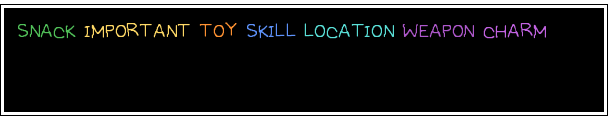

# How to use OMORIBOT

## BASIC USAGE

The basic syntax for omoribot is as follows:

`?tb <name> <portrait> <text...>`

Name is the name of the character which will be displayed in it's own box, or you can type `none` to not have a name box.

Portrait is the character portrait that will be displayed, you can find all of the inbuilt portraits in the Portrait Lists channels, and you can provide your own with `attached`, or you can leave the portrait box out with `none`.

Text is the text that will be displayed in the main dialogue box.

## FORMAT TAGS

In order to format the dialogue, you can use Format Tags.

Format Tags always come in pairs; first is the tag itself (for example: `[shiver]`) and then there will be a matching `[/]`. Everything in between will be formatted.

Available formatting tags:
- `[size=<size>]` Sets the text size.
- `[font=]` Sets the font. List of available fonts will be further down.
- `[color=<color>]` or `[colour=<colour>]` Sets the colour. Accepts basically every format ever, be it html colours `gold` or hex codes `#FFD200`. ("colour" is an alias because I spell it that way)
- `[shiver]`, `[shivering]`, `[shake]` or `[shaky]` Makes the text shiver.
- `[wobbly]` or `[wobbling]` Makes the text wobble.
- `[normal]` or `[reset]` Returns the text to normal, though in most cases you probably shouldn't need to use this when you can just instead end the previous tag with `[/]`.

While this isn't technically a formatting tag, you can place `->` at the end of your message to create the animated cursor that appears in the in-game text boxes.

You can use all of the formatting tags with both the dialogue message and the character name. (You cannot use `->` with the character name.)

## FONT LIST

Available fonts:

- `omori`, `default`, `def`, `normal`: The default font. You probably don't need to set this manually since you can just end the previous font tag with `[/]`.
- `alt`, `alternate`, `other`: The other font in OMORI, used by Stranger for example.
- `emoji`: Twitter's and Discord's emoji font. You can use this font to mix in emoji in the middle of your message.
- `jp`, `japanese`: Japanese font.
- `kr`, `korean`: Korean font. Mostly incomplete.
- `ch`, `cn`, `chinese`: Chinese font.

## RANDOM THINGS

- If you put `&DEBUG&` at the start of your message, it renders a debug visualisation of the first frame of the output.
- You can use tags either as in `[wobbly][/]` or `[wobbly][/wobbly]`. The code doesn't care either way.
- Animated attached portraits are supported, though please be aware that they are always played at 30fps no matter what the original framerate was.

## AVAILABLE COLOURS

1. You can pass any hex string into `[color]`, e.g. `[color=#FE38FF]`
2. You can pass in a HTML5 colour name into `[color]`, e.g. `[color=gold]`
3. You can pass in one of the special colours in the chart below into `[color]`, e.g. `[color=weapon]`

## EXTRA COMMANDS

All of these extra commands support `&DEBUG&` also.

- `?portrait`: Displays just the given portrait framed in a box.
- `?text`: Displays just the given text framed in a box. Same settings as the character name.
- `?guide_header`: Generates one of the headers used in the Discord version of the Usage Guide. Deletes your invocation.
- `?frame`: Displays just the attached image framed in a box, without resizing it. (`?frame_debug` runs it in debug mode since there's nothing to add `&DEBUG&` to)

## CHOICERS

You can create a choicer by using the following syntax:

`?ch <name> <portrait> <choices> <text...>`

where `<choices>` is a `;`-separated list of choices. For example, in order to create a YES/NO dialogue box, you would use `YES;NO` here.

To add an arrow to one of the choices (by default there's no arrows which looks a bit odd), you can simply add `->` before the choice you want. So if you wanted `YES` to be selected by default in the above example, you could use `->YES;NO`, or if you wanted `NO` to be selected, you could use `YES;->NO`.

There is no limit to the amount of choices, and every choice supports the formatting tags above.

## BACKGROUNDS

You can attach a background image to `?tb` and `?ch` by adding `&BACKGROUND&` to the start of the message, and then attaching an image file.

By default, this resizes it to 640 by 480 (the default resolution of OMORI and the one the textboxes are designed for), but you can prevent this by using `&BACKGROUND NO RESIZE&` instead.

If you also have an attached portrait, the first attachment will be the background and the second the portrait.
